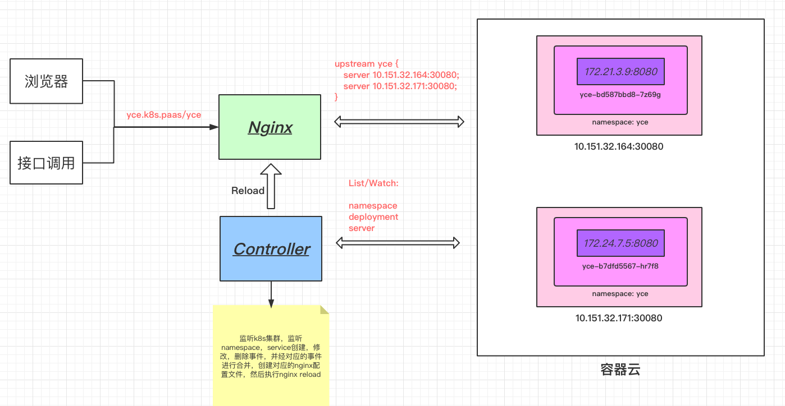
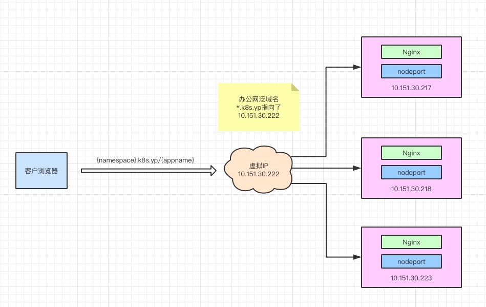

Nodeport
===========

#### 项目说明
--------

这个项目主要目的是：去掉Nodeport的申请环节，通过域名直接访问到应用节点

通过{namespace}.k8s.paas/{deployment}来访问后端应用

#### 架构图
--------

#### 部署结构
----------

#### 注意
--------

* 配置泛域名

* 要设置VIP，并Keepavlived

* Nginx一定要用systemd启停

